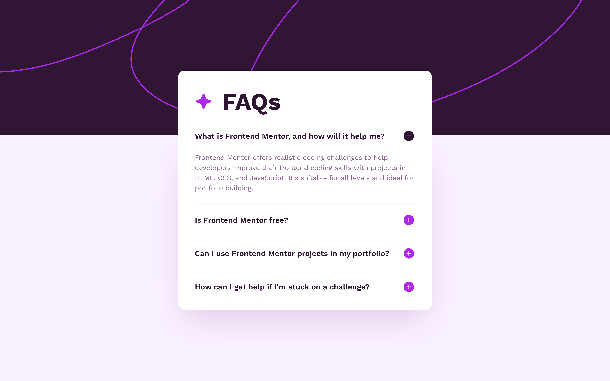

# Frontend Mentor - FAQ accordion

## Table of contents

- [Overview](#overview)
  - [The challenge](#the-challenge)
  - [Screenshot](#screenshot)
  - [Links](#links)
- [My process](#my-process)
  - [Built with](#built-with)
  - [What I learned](#what-i-learned)
  - [Continued development](#continued-development)
  - [Useful resources](#useful-resources)
- [Author](#author)

## Overview

### The challenge

Users should be able to:

- View the optimal layout depending on their device's screen size
- See hover and focus states for interactive elements

### Screenshot

### Links

- Solution URL: [GitHub](https://github.com/marisudris/faq-accordion)
- Live Site URL: [GitHub Pages](https://marisudris.github.io/faq-accordion)

## My process

### Built with

- Semantic HTML5 markup
- CSS custom properties
- Flexbox
- Mobile-first workflow

### What I learned

What makes an accordion accessible, its semantics + aria attributes necessary. Working without a need for transitions/animations makes it relatively straightforward - basically toggling the `hidden` attribute on the accordion panel elements.
If transitions are necessary (they aren't in this challenge, but I still wanted to add some flair), we can use CSS transitions + JavaScript to animate the height of the panel elements - this, admittedly also breaks the focusability rules (elements in closed panels shouldn't be focusable). Even though there weren't any focusable elements in the panels, I still wanted to adhere to the rules, which meant adding additional logic to the TypeScript/JavaScript code to manage the focusability by toggling the `tabindex` attribute on the focusable elements in the panels.

### Continued development

Learn if there are less JavaScripy heavy but accessible solutions for accordion components that have transitions on opening/closing.

### Useful resources
- [**ARIA Accordion Pattern**](https://www.w3.org/WAI/ARIA/apg/patterns/accordion/) for accessible accordion markup and rules.

- [**Clamp calculator**](https://www.marcbacon.com/tools/clamp-calculator/)

- **Pixel Perfect Pro** - add-on available for both Chrome and Firefox browsers. This was useful for making quicker comparisons between the design and my solution.

## Author

- Frontend Mentor - [@maris](https://www.frontendmentor.io/profile/marisudris)
